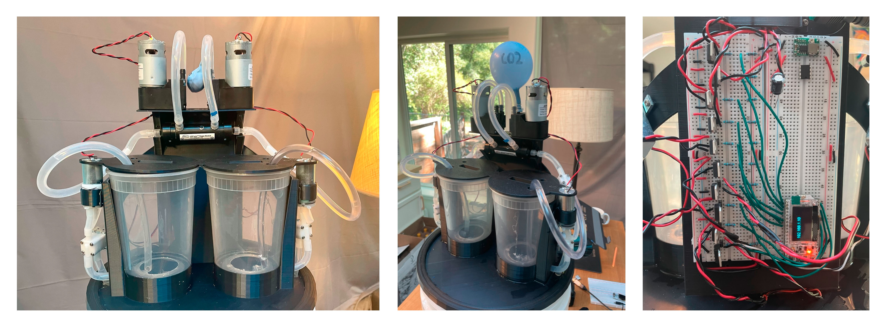

# Synthwave

An open-source experiment in carbon removal based on the electrochemical pH swing of seawater.

Developed by Alex Ose with input from many wonderful collaborators via the
[OpenAir Collective](https://openaircollective.cc/).

-   [OpenAir Forums](https://www.openairforum.org/t/introducing-synthwave/806)
-   [OpenAir Discord](https://openaircollective.cc/join)

## Introduction

Synthwave demonstrates the removal of CO2 from seawater using
[a technique developed by the Alan Hatton lab at MIT](https://pubs.rsc.org/en/content/articlelanding/2023/EE/d2ee03804h)
using a 3D printed shell and common, off-the-shelf components. With a materials list under $300, Synthwave is designed
to be an entry point for anyone looking to learn more about ocean-based carbon capture.

It is designed to be fully hackable, with an emphasis on approachability. Our goal is to bring ocean-based
electrochemical capture to a wider audience!

## Hardware

### Moving parts

The hardware is based around cheap 12V devices (that can easily be sourced from Amazon or eBay) controlled by a common
ESP32 microcontroller. The full list of materials can be found [here](MATERIALS.md).

### 3D printed parts

Each of the above parts are mounted onto a 3D printed frame that can be found in the `/model` directory of this repo.
Because it is designed to sit on top of a standard 5-gallon bucket, printing this frame requires a large-format printer
with a build area of at least 320x320mm.

There are several parts:

-   Base
-   Container cover
-   Back cover (optional)
-   Two pump brackets
-   Two strain relief brackets
-   Two electrode holders

Please refer to the README.md inside of the `/model` directory for pointers on how to print and assemble the device.

### Electrodes

As this is an electrochemistry project, it requires electrodes. While the exact formulation of these are under active
development, I would be happy to send you a working set of electrodes for free. Please get in touch with me directly in
order to arrange this.

Should you choose to develop your own electrodes, please consult
[this thread in the OpenAir forums](https://www.openairforum.org/t/synthwave-electrochemical-co2-capture-from-seawater/781/4)
for more information.

## Software

The software that controls this system is designed to be as readable as possible. It uses Arduino-compatible code to
connect to a local WiFi network and expose a simple API. This API accepts various parameters that allow a client to
toggle each individual pump, solenoid, and/or electrode set.

This allows us to control the system entirely from a web browser, which allows easy fine-tuning of process variables
without the need to continuously re-flash the ESP32 server.

Should you need to re-flash the ESP32, this can be accomplished via the /update endpoint. The software uses the
[ElegantOTA](https://github.com/ayushsharma82/ElegantOTA) library to allow for simple, over-the-air reflashing as to not
require a physical connection to the device.

## System modeling

Our current estimates show that Synthwave removes about of 0.076g of CO2 per run cycle[1]. Assuming a cycle time of five
minutes, an unlimited source of seawater, and non-degrading electrodes, it should be able to remove 22g of CO2 per day.

There are many, many variables that will affect this final number: The quality of the electrodes, the concentration of
CO2 in the seawater, the cycle frequency, and the efficiency of our electrochemical reaction.

Above all else, Synthwave aims to put our assumptions to the test, and help inform our next phase of research.

[1]: The original paper cites 0.0543 mmol of CO2 removed per cycle, with water volumes of about 30mL. Scaling this up to
1L gives us 1.7404 mmol, or 0.0766 grams of CO2.

## Future research

Synthwave is designed to be a simple demonstration of a specific carbon capture technique. In order to achieve
commercial viability, virtually all aspects of this technique will need to be improved.

The main need is to improve the quality of our electrodes. This will likely involve better coating techniques to avoid
degredation and fouling, as well as more accurate measurements, CV charts, etc.

With improved electrodes, the next step would be to improve the throughput of the device to handle much more seawater.
This could be achieved by increasing the size of the system, designing a more efficient cell (ideally a flow cell), or
perhaps building multiple machines to work in parallel with one another.

We hope that by publishing this work under the CERN license, future hackers and collaborators will share their
learnings. It is only by the overwhelming success of carbon capture do we hope to maintain a livable climate. By
investing your time and energy in projects like this one, we may uncover key techniques that make gigaton-scale carbon
capture viable.
